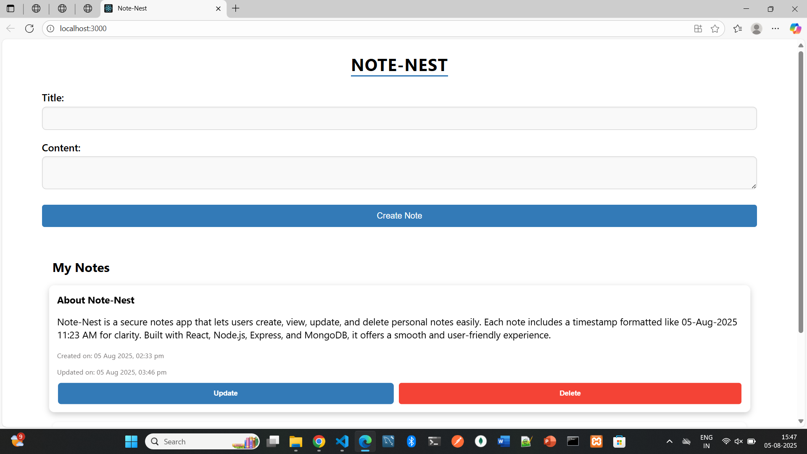
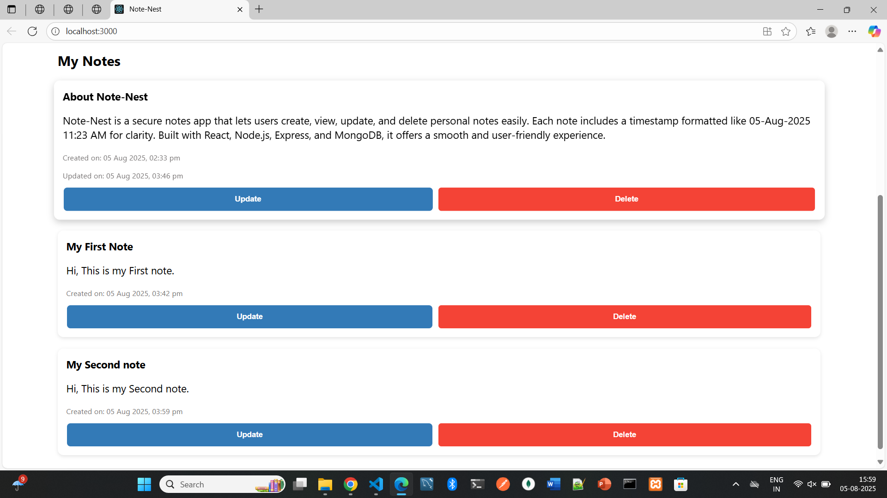

# NoteNest 📝 – Secure Notes App
NoteNest is a full-stack web application that allows users to create, read, update, and delete personal notes. It features a clean user interface built with React and a backend powered by Express and MongoDB.

---

## 🚀 Features

- 🧠 Add, view, update, and delete notes
- 🕒 Notes display creation and update timestamps in a friendly format (e.g., `05-Aug-2025 11:23 AM`)
- 🔐 RESTful API with Express.js and MongoDB
- 🎯 Fully responsive UI built with React
- 📦 Easily customizable and extensible for new features

---

## 📸 Screenshots

### 🏠 Create-Notes


### 📝 Note-List


---

## 🛠️ Tech Stack

### Frontend:
- React
- Axios
- CSS3

### Backend:
- Node.js
- Express.js
- MongoDB
- Mongoose
- dotenv
- CORS

---

## 📁 Project Structure
```bash
note-nest/
│
├── client/ # React frontend
│ ├── src/
│ │ ├── App.js
│ │ ├── components/
│ │ │ ├── create.js
│ │ │ └── notes.js
│ │ └── App.css
│ └── public/
│
├── server/ # Node + Express backend
│ ├── models/
│ │ └── listModels.js
│ ├── routes/
│ │ └── list.js
│ ├── server.js
│ └── .env
```

---

## ⚙️ Setup Instructions

### 1. Clone the repository
```bash
git clone https://github.com/your-username/note-nest.git
cd note-nest
```

### 2. Setup Backend
```bash
cd server
npm install
```
- Create a .env file and add:
```bash
MONGO_URI=mongodb://localhost:27017/note-nest
```
- Run the server:
```bash
node server.js
```

### 3. Setup Frontend
```bash
cd client
npm install
npm start
```

### 4. Access the app
Visit http://localhost:3000 in your browser.

---

## 🧩 Future Enhancements

- User authentication
- Rich text editor for notes
- Tag-based note filtering
- Dark mode toggle

---

## 🤝 Contributing
Contributions are welcome! Feel free to open issues or submit pull requests.

---

## 📄 License
This project is open-source and available under the MIT License.

---

## 📞 Contact
Made with 💙 by [Jeevitha](https://github.com/jeevitha28-g)
